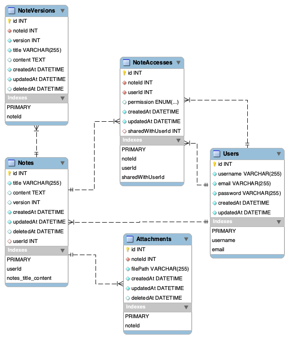
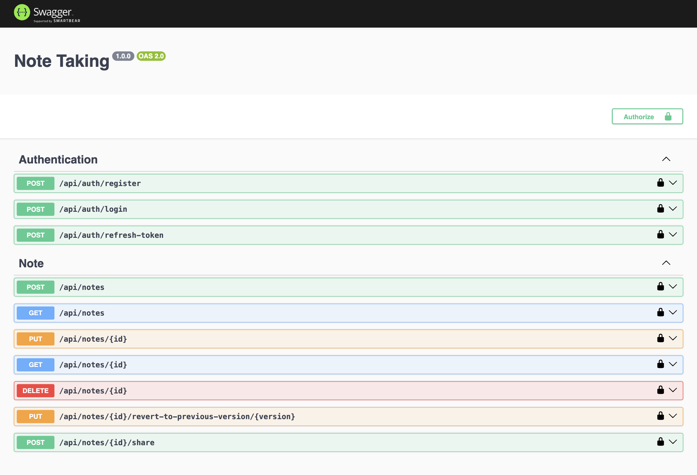

# Respond.io Assessment Task

## ERD



## Pre-Requisites

- **Docker**: latest
- **Node** : Tested on **_v20.11.1_**
- **Yarn** : Tested on **_v1.22.21_**

## Installation/Setup

Run below command to run/create the necessary docker containers, this will create/run 2 docker container, one for DB and one for Redis. with this app will not start in docker.

```
docker-compose up db redis -d
```

Now, run below command, it will install dependencies and will create DB.

```
yarn setup
```

After setup complete, now run below command to start the server in dev mode which uses nodemon for auto restart on file-changes:

```
yarn start:dev
```

### Running in docker

To run the app in docker you will first need to build it using `yarn build` and then create and run docker container using `docker-compose` or `docker` cli

when running in docker `.env` file has 2 values need to changing

**For Running Docker**

```
DB_HOST=db
REDIS_URL=redis://redis
```

then you can run `docker-compose up` to spin up all the containers.

**For running on local outside docker**

```
DB_HOST=localhost
REDIS_URL=redis://localhost:6379
```

### Configuration

For local setup I have added the `.env` file which will speedup the setup on new machine. it contains necessary environment variables.

## API Documentations / Swagger:

Swagger is configured for API testing purpose. once server is up and running you should be able to access swagger on [/api/docs](http://localhost:5001/api/docs/#/)


## Technical Analysis:

Below are are the key points that I consider to be what we can improve in the current system:

- In current implementation the media `Attachments` are on the main `Note` and It can have both pros and cons. But I think `Attachments` should have been configured in proper way by which it can also be part of the `NoteVersion`.

- I think the project should have used `Typescript` instead of `Javascript` which offer more support in reducing the error that may happen at runtime. and also makes the code more predictable and structured.

- The `Singleton` approach in most places in this project seems to be a bit extra I think. things like `controller`, `services` and `repository` doesn't need this approach as `Node` by default support `module caching` and it imports its once even if we use it in multiple files.

## Scalability:

- The project is structured in a way that it can be scaled easily, it utilizes redis and also the access-token and refresh-token are not manage on the server but instead client will keep manage it. which makes it capable of scaling up easily

- The code is structured properly to accommodate new feature/code.
